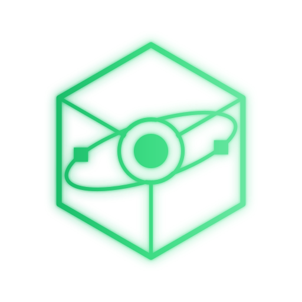

<p align="center">
  
</p>

<h1 align="center">MineUI</h1>

<p align="center">
  <b>The desktop app your Minecraft server has been missing.</b><br>
  Run a managed vanilla server, or attach to an existing Docker/Podman container.<br>
  One native app. No dashboard to self-host, no local API server.
</p>

<p align="center">
  <a href="https://github.com/I4cTime/mineui/actions/workflows/ci.yml"></a>
  <a href="https://github.com/I4cTime/mineui/releases/latest"></a>
  <a href="https://github.com/I4cTime/mineui/releases"></a>
  <a href="LICENSE"></a>
  
  <a href="https://mineui.i4c.studio"></a>
  <a href="https://discord.gg/5uEApw5uEz"></a>
  <a href="https://x.com/i4c_studio"></a>
</p>

<p align="center">
  <a href="#why-mineui">Why</a> &middot;
  <a href="#install">Install</a> &middot;
  <a href="#features">Features</a> &middot;
  <a href="#development">Development</a> &middot;
  <a href="#license">License</a>
</p>

---

## Why MineUI?

Running a Minecraft server means juggling `server.properties` in a text
editor, an RCON client for admin commands, `docker logs -f` or a container
dashboard for status, and manual `tar` commands for backups — or a
self-hosted web panel that means running yet another service (and securing
it) just to manage the one you actually care about.

MineUI is a native desktop app, not a web panel: **Tauri v2** (Rust backend)
driving a **Next.js** static-export frontend over Tauri IPC — no Electron, no
bundled Chromium, no local HTTP server to expose or secure. It runs in one of
two modes:

- **Simple mode (default)** — MineUI creates and runs a vanilla server for
  you: pick a Minecraft version, set memory, accept the EULA, and MineUI
  downloads the official server jar (SHA-1 verified), configures RCON, and
  supervises the Java process. No containers required.
- **Advanced mode** — attach to an existing Minecraft server container
  managed by **Docker or Podman** (auto-detected, Podman preferred): control,
  logs, players, RCON, mods/plugins, config editing, backups, and container
  metrics. MineUI attaches to a container that already exists (e.g. an
  `itzg/minecraft-server`-style image with the world/config under `/data`) —
  it does not create or pull one for you.

## Install

Grab the build for your platform from the
[latest release](https://github.com/I4cTime/mineui/releases/latest):

| Platform | Package |
| --- | --- |
| Linux x86_64 | `MineUI_2.0.0_amd64.AppImage` — `chmod +x` and run |
| Debian/Ubuntu | `MineUI_2.0.0_amd64.deb` — `sudo apt install ./MineUI_2.0.0_amd64.deb` |
| Windows x64 | `MineUI_2.0.0_x64-setup.exe` |
| macOS (Apple Silicon) | `MineUI_2.0.0_aarch64.dmg` |
| macOS (Intel) | `MineUI_2.0.0_x64.dmg` |

Simple mode needs Java installed (MineUI version-checks it against the
Minecraft release you pick). Advanced mode needs Docker or Podman.

> `v1.0.0` on the Releases page is the old Electron app — it predates this
> architecture and isn't what this README describes.

The released binaries are free. Building from source **requires a HeroUI
Pro license** — see [Note on HeroUI Pro](#note-on-heroui-pro) below before
you start.

Website & docs: [mineui.i4c.studio](https://mineui.i4c.studio)

## Features

### Server control and live status

Start, stop, and restart (managed process or container), with live TPS,
MSPT, player count, and server version, plus a streamed log viewer — no
polling.

### Player management

Online players, join/leave history with last-seen and IP, and one-click
whitelist/op/ban/kick actions.

### RCON console

An allowlisted command panel — only vetted commands can be run, even with
raw RCON access configured.

### Mods & plugins

Browse what's installed, upload a jar from disk, or download one from a URL.

### Configuration editor

Edit `server.properties` and files under `config/` directly from the app.

### World backups

Create, list, restore, and delete `.tar.gz` snapshots.

### System metrics

CPU, memory, and disk, plus network/block IO when attached to a container.

### Four themes

Deepslate & Emerald (default), Phosphor Amber, Quantum Fluidity, and Soft
Glass — switchable in Settings, persisted locally. The token contract behind
them is in [`docs/theme-contract.md`](docs/theme-contract.md).

### Enriched metrics via a companion mod (Advanced mode, optional)

Point Settings' **Server utils URL** at an instance of
[mineui_server_utils](https://github.com/I4cTime/mineui_server_utils) — a
Forge 1.20.1 mod or Paper/Bukkit plugin that runs inside the server JVM — for
real tick-based TPS/MSPT, per-dimension chunk/entity counts, and the actual
loaded mod/plugin list. Without it, MineUI falls back to a server-list ping
plus container/process metrics; everything else still works.

### Every backend call is typed and contract-bound

`crates/mineui-core` is pure Rust (no Tauri dependency, 84 unit tests);
`src-tauri` is a thin `#[tauri::command]` shell (31 IPC commands) that
delegates to it. The full command/error/event surface is specified in
[`docs/v2-contract.md`](docs/v2-contract.md) — binding, not a suggestion; see
[CONTRIBUTING.md](CONTRIBUTING.md).

## Development

Prerequisites: [pnpm](https://pnpm.io) and Rust via
[rustup](https://rustup.rs) (stable toolchain) — see the
[Tauri v2 prerequisites](https://v2.tauri.app/start/prerequisites/) for
platform-specific system packages. On Linux:

```bash
sudo apt install libwebkit2gtk-4.1-dev build-essential libssl-dev librsvg2-dev
```

```bash
pnpm install
pnpm tauri dev     # Next.js dev server + Tauri window
```

Other commands:

- `pnpm dev` — frontend only, in a plain browser (no backend; IPC calls fail
  soft with a "Backend unavailable" notice)
- `pnpm build` — static export to `out/` (what Tauri bundles)
- `pnpm lint` — ESLint
- `pnpm tauri build` — production desktop bundle
- `cargo test -p mineui-core` — Rust unit tests (84 tests; must stay green)

CI (`.github/workflows/ci.yml`) runs lint/typecheck/build on the frontend and
`cargo fmt`/`clippy`/`test` plus a `cargo check` of the Tauri shell, on every
push to `main`/`v2-tauri` and PR into `main`.

### Note on HeroUI Pro

The UI uses `@heroui-pro/react` (KPI cards, EmptyState, Stepper, and other
Pro components), a **commercially licensed** package from NextUI Inc. The
npm package on the public registry is a stub — its postinstall script
downloads the real components only with an authenticated session
(`npx heroui-pro login`) or an `HEROUI_AUTH_TOKEN` environment variable.
Without either, `pnpm install` appears to succeed but the package is empty
and the build fails to resolve `@heroui-pro/react` imports. Get a license at
[heroui.com/pro](https://heroui.com/pro), or open an issue if this is
blocking a contribution.

## License

AGPL-3.0-only — see [LICENSE](LICENSE). Fonts are self-hosted under their own
licenses (MIT/OFL) via [Fontsource](https://fontsource.org); Monocraft is
vendored under the SIL OFL — see `app/fonts/Monocraft-LICENSE.txt`.
`@heroui-pro/react` is separately, commercially licensed — see
[Note on HeroUI Pro](#note-on-heroui-pro).

[](https://ko-fi.com/K3K11SM7LV)
