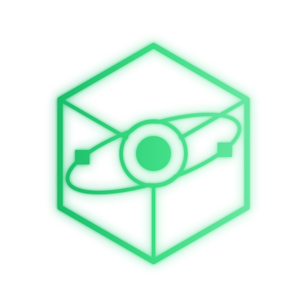

<p align="center">
  
</p>

<h1 align="center">MineUI</h1>

<p align="center">
  <b>The desktop app your Minecraft server has been missing.</b><br>
  Run managed vanilla servers, create modded ones in containers, or attach to the Docker/Podman containers you already have — several at once.<br>
  One native app. No dashboard to self-host, no local API server.
</p>

<p align="center">
  <a href="https://github.com/I4cTime/mineui/actions/workflows/ci.yml"></a>
  <a href="https://github.com/I4cTime/mineui/releases/latest"></a>
  <a href="https://github.com/I4cTime/mineui/releases"></a>
  <a href="LICENSE"></a>
  
  <a href="https://mineui.i4c.studio"></a>
  <a href="https://discord.gg/5uEApw5uEz"></a>
  <a href="https://x.com/i4c_studio"></a>
</p>

<p align="center">
  <a href="#why-mineui">Why</a> &middot;
  <a href="#install">Install</a> &middot;
  <a href="#features">Features</a> &middot;
  <a href="#development">Development</a> &middot;
  <a href="#license">License</a>
</p>

---

## Why MineUI?

Running a Minecraft server means juggling `server.properties` in a text
editor, an RCON client for admin commands, `docker logs -f` or a container
dashboard for status, and manual `tar` commands for backups — or a
self-hosted web panel that means running yet another service (and securing
it) just to manage the one you actually care about.

MineUI is a native desktop app, not a web panel: **Tauri v2** (Rust backend)
driving a **Next.js** static-export frontend over Tauri IPC — no Electron, no
bundled Chromium, no local HTTP server to expose or secure. It manages any
number of servers at once, and each one runs in one of two modes:

- **Simple mode (default)** — MineUI creates and runs a vanilla server for
  you: pick a Minecraft version, set memory, accept the EULA, and MineUI
  downloads the official server jar (SHA-1 verified), configures RCON, and
  supervises the Java process. No containers required.
- **Advanced mode** — a Minecraft server container managed by **Docker or
  Podman** (auto-detected, Podman preferred): control, logs, players, RCON,
  mods/plugins, config editing, backups, and container metrics. MineUI can
  **create** the container for you from the `itzg/minecraft-server` image —
  Vanilla, Paper, Purpur, Fabric, Quilt, Forge or NeoForge — or **attach** to
  one that already exists (any image of that style, with the world/config
  under `/data`).

## Install

Grab the build for your platform from the
[latest release](https://github.com/I4cTime/mineui/releases/latest):

| Platform | Package |
| --- | --- |
| Linux x86_64 | `MineUI_2.9.0_amd64.AppImage` — `chmod +x` and run |
| Debian/Ubuntu | `MineUI_2.9.0_amd64.deb` — `sudo apt install ./MineUI_2.9.0_amd64.deb` |
| Windows x64 | `MineUI_2.9.0_x64-setup.exe` |
| macOS (Apple Silicon) | `MineUI_2.9.0_aarch64.dmg` |
| macOS (Intel) | `MineUI_2.9.0_x64.dmg` |

Simple mode needs Java installed (MineUI version-checks it against the
Minecraft release you pick). Advanced mode needs Docker or Podman.

### Installing a container runtime

Either works; MineUI finds it by itself and prefers Podman when both exist.

| | Podman (recommended) | Docker |
| --- | --- | --- |
| **Linux** | `sudo apt install podman` · `sudo dnf install podman` · `sudo pacman -S podman` · `sudo zypper install podman` | Install [Docker Engine](https://docs.docker.com/engine/install/), then `sudo usermod -aG docker $USER` and log out and back in — MineUI runs `docker` as you, without sudo |
| **Windows** | `wsl --install` (once, restart), `winget install RedHat.Podman`, `podman machine init`, `podman machine start` — or [Podman Desktop](https://podman-desktop.io) | `winget install Docker.DockerDesktop`, start it once |
| **macOS** | `brew install podman`, `podman machine init`, `podman machine start` — or [Podman Desktop](https://podman-desktop.io) | `brew install --cask docker-desktop`, start it once |

Installed but MineUI still reports none? An app started from a launcher can
have a shorter `PATH` than your terminal (common with Homebrew on macOS). Put
the full path to `podman` or `docker` in Server Settings → Runtime binary
override.

> `v1.0.0` on the Releases page is the old Electron app — it predates this
> architecture and isn't what this README describes.

The released binaries are free. Building from source **requires a HeroUI
Pro license** — see [Note on HeroUI Pro](#note-on-heroui-pro) below before
you start.

Website & docs: [mineui.i4c.studio](https://mineui.i4c.studio)

## Features

### Several servers at once

Add as many servers as you run — a Forge pack, a Fabric pack, a managed
vanilla world — and MineUI manages all of them at the same time. Each one is
its own profile with its own mode, connection, RCON allowlist, schedule,
backup policy, player notes and activity log; scheduled restarts and backups
keep running for every server, not just the one on screen. The header
switcher and the dashboard's *All servers* strip show every server's state
and player count at a glance, with start/stop right there. Every page header
names the server it is showing and what that server actually is — loader and
version, container, address — so two similar servers are never mixed up. Add,
rename and remove servers in App Settings → Servers. Removing one only makes
MineUI forget it: its container, world and backups are never touched.

### Create a modded server without touching the command line

Adding a server offers three routes: a **new container**, an **existing
container**, or a **managed vanilla** process. For a new container MineUI
creates an [`itzg/minecraft-server`](https://github.com/itzg/docker-minecraft-server)
container for you — pick Vanilla, Paper, Purpur, Fabric, Quilt, Forge or
NeoForge, the Minecraft version, memory and ports — picks the image with the
right Java for that version, generates the RCON password, and connects itself
to the result. The world lives in a named volume.

**Deleting is always your call.** MineUI removes a container only when you
ask it to — *Delete container* in Server Settings, or the tick box when you
remove a server — and it keeps the world unless you tick that too and type
the container's name. A world stored in a folder on your computer is never
deleted. Deleting just the container is also how you start a server over
with a different loader or modpack.

**Or start from a modpack.** Choose *A modpack* instead of a server type:
search [Modrinth](https://modrinth.com/modpacks) right in the app (only packs
that can run on a server are listed), paste a CurseForge pack's page
address, or hand over the zip the CurseForge app makes with *Export profile*
(MineUI reads the pack's name and Minecraft version from its manifest), and
the server comes up with the pack's loader and mods installed. No API key
needed for any of them. A modpack is applied when the container is created —
to switch packs, delete the container in Server Settings and create it again.

**No Podman or Docker yet?** Wherever a container is needed and neither is
installed, MineUI shows the install steps for your OS (Linux, Windows, macOS)
with copyable commands, and a *Check again* button — see also
[Installing a container runtime](#installing-a-container-runtime).

### App settings vs. server settings

The header's sliders button opens **App Settings** — the server list, theme
and accent, which apply to MineUI as a whole. **Settings** in the navigation
is always the open server's own: mode, connection, scheduled tasks, backup
policy, RCON allowlist.

### Server control and live status

Start, stop, and restart (managed process or container), with live TPS,
MSPT, player count, and server version, plus a streamed log viewer — no
polling.

### Player management

Online players, join/leave history with last-seen and IP, one-click
whitelist/op/ban/kick actions, and a private note per player for whatever you
need to remember about them.

### RCON console

An allowlisted command panel — only vetted commands can be run, even with
raw RCON access configured.

### Mods & plugins

Browse what's installed, upload a jar from disk, or download one from a URL.
The add dialog preselects mod or plugin from what the server runs and warns
when the choice cannot load there. Have a whole set of mods as a `.zip` — a
zipped folder, or a server pack? MineUI unpacks the jars inside and installs
them together, which is the way to put a pack's mods onto a server that
already exists.

### Configuration editor

Edit `server.properties` and files under `config/` directly from the app.

### World backups

Create, list, restore, and delete `.tar.gz` snapshots. A retention policy
keeps only the newest N, and every new snapshot can be copied to a directory
of your choice — a NAS mount, a USB drive, a second disk.

### Scheduled tasks

Automatic restarts (with an optional chat warning 60 s ahead), scheduled
backups, and timed chat broadcasts — every N hours, daily, or weekly at a
local time, configured in Settings and shown with their next run.

### Activity log

Every action taken from the app or by the scheduler — server control, player
actions, RCON commands, backups, config edits — lands in an append-only log
on the Status page, with the outcome and the error if it failed.

### System metrics

CPU, memory, and disk, plus network/block IO when attached to a container.

### Four styles, dark and light

Deepslate & Emerald (default), Phosphor Amber, Quantum Fluidity and Soft
Glass — each with a dark and a light palette. Pick **Dark, Light or Match
system** and a style in App Settings → Appearance, and optionally override
the accent color. The token system behind them is in
[`docs/theme-contract.md`](docs/theme-contract.md).

### Enriched metrics via a companion mod (Advanced mode, optional)

Point a server's Settings → **Server utils URL** at an instance of
[mineui_server_utils](https://github.com/I4cTime/mineui_server_utils) — a
Forge 1.20.1 mod or Paper/Bukkit plugin that runs inside the server JVM — for
real tick-based TPS/MSPT, per-dimension chunk/entity counts, and the actual
loaded mod/plugin list. Without it, MineUI falls back to a server-list ping
plus container/process metrics; everything else still works.

### Every backend call is typed and contract-bound

`crates/mineui-core` is pure Rust (no Tauri dependency, 198 unit tests);
`src-tauri` is a thin `#[tauri::command]` shell (47 IPC commands) that
delegates to it. The full command/error/event surface is specified in
[`docs/v2-contract.md`](docs/v2-contract.md) — binding, not a suggestion; see
[CONTRIBUTING.md](CONTRIBUTING.md).

## Development

Prerequisites: [pnpm](https://pnpm.io) and Rust via
[rustup](https://rustup.rs) (stable toolchain) — see the
[Tauri v2 prerequisites](https://v2.tauri.app/start/prerequisites/) for
platform-specific system packages. On Linux:

```bash
sudo apt install libwebkit2gtk-4.1-dev build-essential libssl-dev librsvg2-dev
```

```bash
pnpm install
pnpm tauri dev     # Next.js dev server + Tauri window
```

Other commands:

- `pnpm dev` — frontend only, in a plain browser (no backend; IPC calls fail
  soft with a "Backend unavailable" notice)
- `pnpm build` — static export to `out/` (what Tauri bundles)
- `pnpm lint` — ESLint
- `pnpm tauri build` — production desktop bundle
- `cargo test -p mineui-core` — Rust unit tests (198 tests; must stay green)

CI (`.github/workflows/ci.yml`) runs lint/typecheck/build on the frontend and
`cargo fmt`/`clippy`/`test` plus a `cargo check` of the Tauri shell, on every
push to `main`/`v2-tauri` and PR into `main`.

### Note on HeroUI Pro

The UI uses `@heroui-pro/react` (KPI cards, EmptyState, Stepper, and other
Pro components), a **commercially licensed** package from NextUI Inc. The
npm package on the public registry is a stub — its postinstall script
downloads the real components only with an authenticated session
(`npx heroui-pro login`) or an `HEROUI_AUTH_TOKEN` environment variable.
Without either, `pnpm install` appears to succeed but the package is empty
and the build fails to resolve `@heroui-pro/react` imports. Get a license at
[heroui.com/pro](https://heroui.com/pro), or open an issue if this is
blocking a contribution.

## License

AGPL-3.0-only — see [LICENSE](LICENSE). Fonts are self-hosted under their own
licenses (MIT/OFL) via [Fontsource](https://fontsource.org); Monocraft is
vendored under the SIL OFL — see `app/fonts/Monocraft-LICENSE.txt`.
`@heroui-pro/react` is separately, commercially licensed — see
[Note on HeroUI Pro](#note-on-heroui-pro).

[](https://ko-fi.com/K3K11SM7LV)
